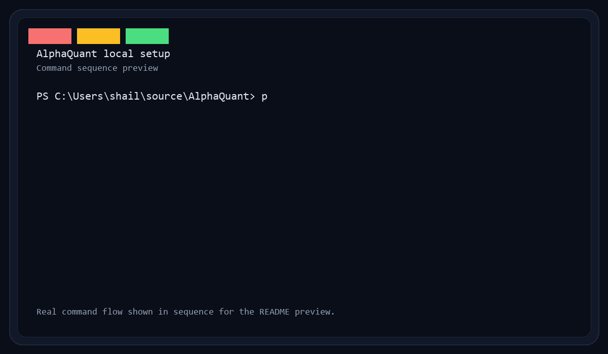
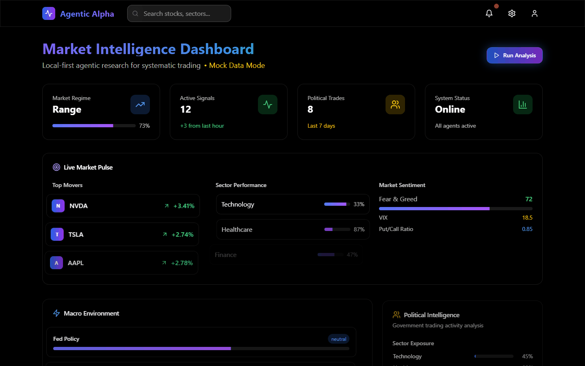
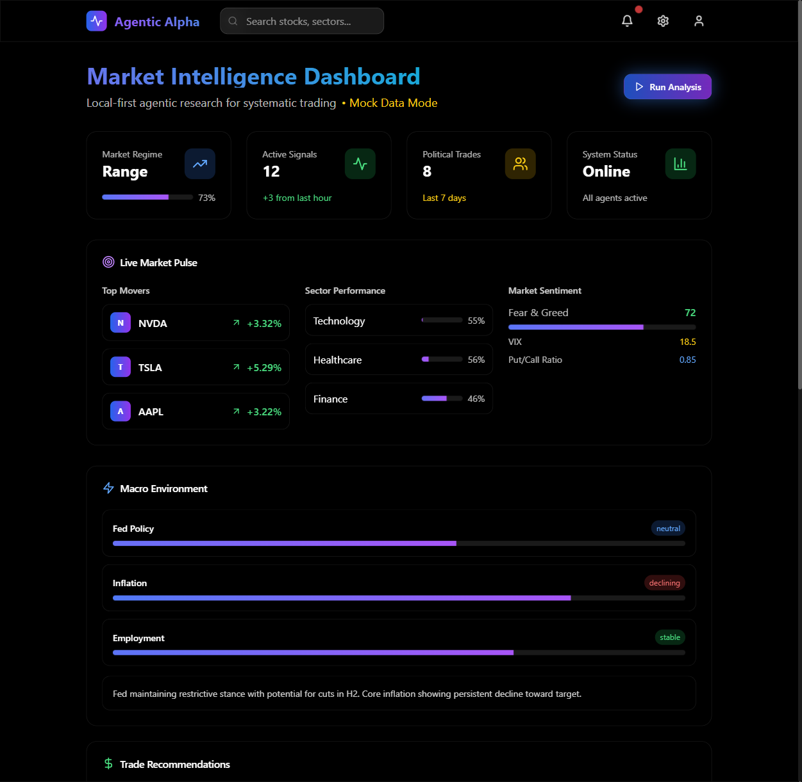

# Agentic Alpha Engine (AlphaQuant)

Local-first, Docker-first agentic research stack that ingests macro, cross-asset, options, and politician/government trades, then outputs Rev-4 “Fusion” reports with double-sourced facts, timestamps (PT), POP scores, roll/repair logic, and trade tables.

**TL;DR:** Local-first agentic research engine that chains LLM agents over market, flow, and politician-trade data to produce structured “Fusion” reports. Inspired by systematic research workflows used to surface high-conviction trades without relying on cloud LLMs.

**Tech stack:** Python, FastAPI, LangGraph-style agents, Postgres, Redis, Qdrant, MinIO, OpenSearch, Ollama, Docker

Demo assets

The terminal preview above is a GitHub-renderable GIF generated from the local setup flow. The VHS tape sources are still available in [artifacts/quick-setup.tape](artifacts/quick-setup.tape) and [artifacts/setup-demo.tape](artifacts/setup-demo.tape).

The UI GIF is generated from 18 frames for smoother motion. Re-render it with `python scripts/generate_ui_gif.py` after starting the frontend on `http://127.0.0.1:5173/`.

Terminal demo tape
- VHS tape source: [artifacts/quick-setup.tape](artifacts/quick-setup.tape)
- Longer setup tape source: [artifacts/setup-demo.tape](artifacts/setup-demo.tape)
- On Windows, the raw VHS render path is `C:\Users\shail\go\bin\vhs.exe artifacts/quick-setup.tape` after adding the Playwright Chromium binary to `PATH`.

Quick start
- Copy env: `cp .env.example .env` and fill keys (or use SCRAPE_ONLY=true semantics later).
- Build: `docker compose up -d --build`
- Pull models (first run): `docker exec -it ollama ollama pull llama3.1:8b mxbai-embed-large deepseek-r1:7b`
- Call API: `POST http://localhost:8000/run` with sample payloads in `samples/`.

Structure
- FastAPI orchestrator with LangGraph-style flow (stubbed here).
- Agents for discovery → crawl → normalize → entities → macro → cross-asset → sectors → technicals → flows → politicians → synthesis → verify.
- Storage: Postgres, Redis, Qdrant, MinIO, OpenSearch (compose includes services).
- Local models: Ollama (compose service) and embeddings (to be pulled at runtime).

Small-world test
- Run `python scripts/run_small_world.py` to exercise a minimal pipeline (no paid APIs), and print a Rev-4 style JSON.

Frontend integration (separate repo)
- Repo example: `https://github.com/smgpulse007/AlphaQuantFrontEnd.git`
- Option A (fastest dev): run the frontend locally and point it at the API
  - Set `VITE_API_BASE_URL=http://localhost:8000` (or `NEXT_PUBLIC_API_BASE_URL` for Next.js)
  - Start your dev server (`npm run dev` or equivalent)
- Option B (Compose, static SPA)
  - Clone the frontend into `frontend/` at repo root: `git clone <your-frontend-repo> frontend`
  - Or add as submodule: `git submodule add <your-frontend-repo> frontend`
  - Build both: `docker compose -f docker-compose.yml -f docker-compose.ui.yml up -d --build`
  - Open UI at `http://localhost:8080` (UI calls API at `http://api:8000` on the compose network)
  - Adjust Dockerfile if the frontend is SSR (Next.js) instead of SPA; provided Dockerfile targets Vite/React SPA by default.

Notes for UI Dockerfile
- `docker/ui.Dockerfile` expects the frontend to produce `dist/` via `npm run build`.
- If your UI is Next.js SSR, use a Node runtime instead of Nginx and run `npm run start` after `npm run build`.

Notes
- All timestamps in PT. Double-source rule enforced in verifier stub (warnings for missing corroboration).
- Replace stubs incrementally; see TODOs in each agent/tool.
